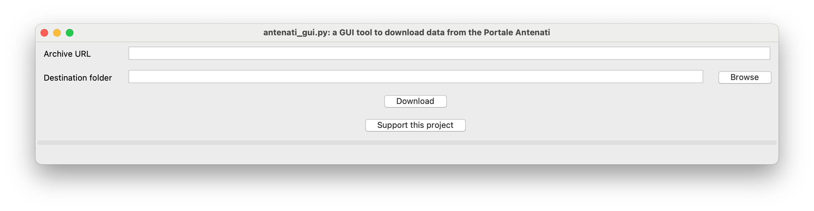

# antenati
A tool to download data from the *[Portale Antenati](http://antenati.cultura.gov.it/)*, the genealogy digital archive maintained by the italian **Ministero per i beni e le attività culturali**.

Since the website tends to be pretty slow in the evening, we present a script to help the retrieval of the documents for your family tree. The script allows you to download **all the images of any archive at the same time**, without any human action. Just launch the script and have a coffee while it downloads all the stuff for you.

## GUI version

Just get the executable from the [release artifacts](https://github.com/gcerretani/antenati/releases/latest), and have fun!

#### Example:
In the website, navigate to the archive you want to download. For example, for the people born in Viareggio in 1807 you should find the page:

[https://antenati.cultura.gov.it/ark:/12657/an_ua19944535/w9DWR8x](https://antenati.cultura.gov.it/ark:/12657/an_ua19944535/w9DWR8x)

Copy the link to the first page, and paste it in the Archive URL field of the window. Then, specify a destination folder: the results will be placed there, in a new subfolder named *archivio-di-stato-di-lucca-stato-civile-napoleonico-viareggio-1807-nati-19944549*.

## CLI version

### Requirements
The software is written in Python 3 and requires Python 3.10 or newer. On Windows the version on the Microsoft Store is fine, on Linux use your distribution package manager.

### Install
From a checkout of this repository:

    pip install .

This installs an `antenati` command on your `PATH` (and an `antenati-gui` one for the GUI).

### Run
To download the images of a gallery, pass the URL of the gallery page:

    antenati <URL of the album>

You can also invoke the package directly without installing the script:

    python3 -m antenati <URL of the album>

The files will be downloaded to a new folder named as *ARCHIVE-PLACE-YEAR-TYPE-ID* of the downloaded archive. For more options, see the help:

    antenati -h

#### Example:
In the website, navigate to the archive you want to download. For example, for the people born in Viareggio in 1807 you should find the page:

[https://antenati.cultura.gov.it/ark:/12657/an_ua19944535/w9DWR8x](https://antenati.cultura.gov.it/ark:/12657/an_ua19944535/w9DWR8x)

Then, copy the link to the first page, and call the script with that link as argument:

    antenati https://antenati.cultura.gov.it/ark:/12657/an_ua19944535/w9DWR8x

The results will be placed in a folder named *archivio-di-stato-di-lucca-stato-civile-napoleonico-viareggio-1807-nati-19944549*.

To include the archive and image IDs in the saved file names (e.g. `pag-1+an_ua19944535+w9DWR8x.jpg` instead of `pag-1.jpg`), add the `-d`/`--descriptive-names` flag.

## AWS WAF challenge

Outside Italy, the Portale Antenati gallery pages are often protected by an AWS WAF challenge that this tool cannot solve, and the download fails with an *AWS WAF challenge cannot be bypassed* error (see [#25](https://github.com/gcerretani/antenati/issues/25)). The IIIF manifest and the images themselves are **not** behind the WAF, so you can work around it:

1. open the gallery page in your browser;
2. copy the **IIIF manifest** link at the bottom of the left side panel (it looks like `https://dam-antenati.cultura.gov.it/antenati/containers/.../manifest`);
3. pass that URL to the tool (both CLI and GUI) instead of the gallery page URL.
